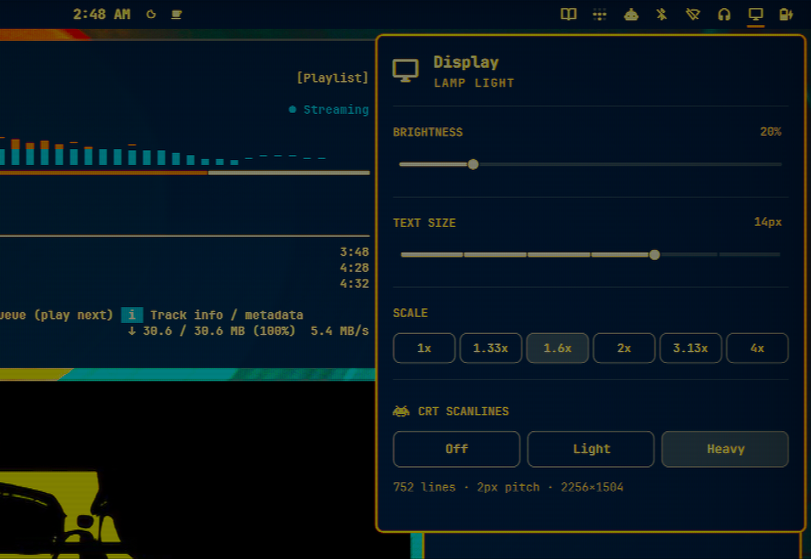
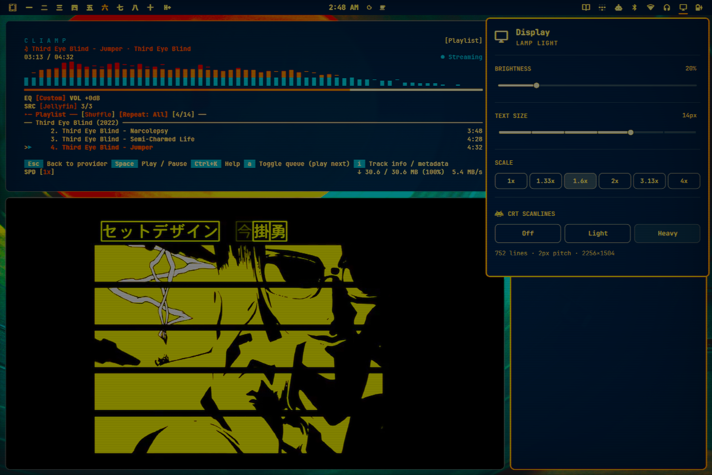

# Display Scanlines

Omarchy’s Display panel with resolution-aware CRT scanline presets. It preserves the stock brightness, text-size, display-scale, and monitor controls, then adds a **󰯉 CRT Scanlines** power toggle with **Light** and **Heavy** presets.

<p align="center">
  
</p>

> The root preview is the original lossless 1334×920 PNG, displayed responsively at full README width with no destructive resampling or JPEG conversion.

## Presets

| Preset | Character |
|---|---|
| **Light** | Subtle, all-day scanlines with no warmth or glow |
| **Heavy** | Pitch-black gaps, warmer phosphors, deeper vignette, stronger saturation, and controlled glow |

The power toggle unloads the shader without changing the selected preset. Light or Heavy can also be selected while power is off, and that choice is restored the next time the effect is enabled.

Both presets use the same scanline pitch and `CONTRAST 0.34`. They differ in beam profile, color, blur, mask, warmth, vignette, and glow—not line size or midtone contrast.

Everything from Omarchy’s stock Display panel continues to work:

- Display brightness
- Shell and GTK text size
- Display scale presets
- Multi-monitor enable/disable controls
- Scroll-wheel brightness adjustment and OSD

## Full-desktop preview

<p align="center">
  
</p>

## Why the scanlines stay even

The effect is calculated from physical output pixels rather than logical coordinates:

1. `textureSize(tex, 0)` returns the physical framebuffer size for each output. A 2256×1504 display at 1.6× scale reports 2256×1504—not 1410×940.
2. `gl_FragCoord` maps 1:1 to physical pixels.
3. Beam phase uses integer modulo: `int(gl_FragCoord.y) % pitch`.

Typical sine/UV scanlines can accumulate phase error and produce drifting line thickness. Here, every scanline cell is generated by identical integer arithmetic. The pitch also prefers an exact divisor of the output height:

| Output height | Pitch | Scanlines |
|---:|---:|---:|
| 1080 | 2px | 540 |
| 1504 | 2px | 752 |
| 1600 | 2px | 800 |
| 2160 (4K) | 3px | 720 |
| 2880 | 4px | 720 |
| 4320 (8K) | 4px | 1080 |

The shader resolves output dimensions independently on each render pass, so different monitors, scales, hotplug events, and mode changes require no shader regeneration.

## Image-quality details

- **Linear-light processing:** samples use the exact piecewise sRGB transfer before beam, mask, blur, and glow calculations.
- **Analytic brightness compensation:** average beam and phosphor-mask energy are normalized instead of using an arbitrary brightness fudge factor.
- **Brightness-dependent beam width:** highlights bloom wider, like a real CRT.
- **Asymmetric spot shape:** horizontal blur is wider than vertical blur to resemble a swept electron beam rather than generic soft focus.
- **Controlled Heavy glow:** three weighted radii decay monotonically from 1.13px to 3.4px. This replaces a hollow 2.5–5px ring that looked halo-like.
- **Static shader:** no `time` uniform, flicker, or rolling animation, so Hyprland damage tracking remains effective.

## Requirements

- Omarchy Quattro
- Hyprland with Lua configuration and `decoration.screen_shader` support
- No external packages, elevated privileges, or install hooks

The plugin invokes only Omarchy/Hyprland commands already present on an Omarchy system. Power and preset state are stored beneath `~/.local/state/omarchy/`; the plugin does not overwrite user configuration.

## Install

Install and enable the plugin:

```sh
omarchy plugin add https://github.com/TyRichards/omarchy-display-scanlines.git --enable
```

Disable the stock Display widget to avoid showing two display panels:

```sh
omarchy plugin disable omarchy.monitor
```

If needed, place Display Scanlines in the right bar section:

```sh
omarchy bar move io.github.tyrichards.display-scanlines --section right
```

## Use

Use the switch at the bottom of the Display panel to turn scanlines on or off. Click **Light** or **Heavy** to select the preset independently; the selected button remains active while power is off.

The bundled CLI can also control power and preset separately:

```sh
~/.config/omarchy/plugins/io.github.tyrichards.display-scanlines/bin/display-scanlines on
~/.config/omarchy/plugins/io.github.tyrichards.display-scanlines/bin/display-scanlines off
~/.config/omarchy/plugins/io.github.tyrichards.display-scanlines/bin/display-scanlines toggle
~/.config/omarchy/plugins/io.github.tyrichards.display-scanlines/bin/display-scanlines light
~/.config/omarchy/plugins/io.github.tyrichards.display-scanlines/bin/display-scanlines heavy
~/.config/omarchy/plugins/io.github.tyrichards.display-scanlines/bin/display-scanlines status
```

Shell IPC is available as well:

```sh
omarchy-shell display-scanlines crt toggle
omarchy-shell display-scanlines crt light
omarchy-shell display-scanlines crt heavy
omarchy-shell display-scanlines state
```

### Optional keybinding

`SUPER + CTRL + MINUS` makes a fitting power shortcut—the minus key is the scanline. It toggles the effect without changing the saved Light/Heavy preset:

```lua
-- This chord is declared upstream as code:20, so unbind that exact form.
hl.unbind("SUPER + CTRL + code:20")
o.bind("SUPER + CTRL + code:20", "Toggle CRT scanlines", "omarchy-shell -q display-scanlines crt toggle")
```

This replaces Omarchy’s default **Expand window left a lot** binding.

## Persistence and generated files

The selected Light/Heavy preset is saved independently of power in:

```text
~/.local/state/omarchy/display-scanlines/preset
```

While enabled, login and `hyprctl reload` persistence is provided by:

```text
~/.local/state/omarchy/toggles/hypr/zz-display-scanlines.lua
```

Turning power off removes that toggle module but keeps the preset file. Generated shaders also live beneath `~/.local/state/omarchy/display-scanlines/`.

The two presets share one source body, `shaders/crt.body.glsl`. The CLI prepends `CRT_LEVEL` and rebuilds the selected generated shader whenever needed. Do not edit generated files.

## Remove

Turn the effect off, remove the plugin, and restore Omarchy’s stock Display widget:

```sh
~/.config/omarchy/plugins/io.github.tyrichards.display-scanlines/bin/display-scanlines off
omarchy plugin remove io.github.tyrichards.display-scanlines --yes
omarchy plugin enable omarchy.monitor right
```

## Validate

```sh
omarchy plugin validate ~/.config/omarchy/plugins/io.github.tyrichards.display-scanlines
qmllint -I "$OMARCHY_PATH/shell" \
  ~/.config/omarchy/plugins/io.github.tyrichards.display-scanlines/Panel.qml
```

## Implementation notes

- GLSL preprocessor conditions use integer `USE_*` flags. Floating-point literals in `#if` are invalid and can silently select the wrong branch on some drivers.
- `scanlinePitch()` exists in both GLSL and `Model.js`; the shader is authoritative, while JavaScript supplies the panel readout.
- The Heavy preset’s dark gaps are controlled primarily by `BEAM_MAX`, because beam width increases with content brightness.

## License

MIT. The Display panel and model were derived from Omarchy’s MIT-licensed native Display widget. See [LICENSE](LICENSE).
